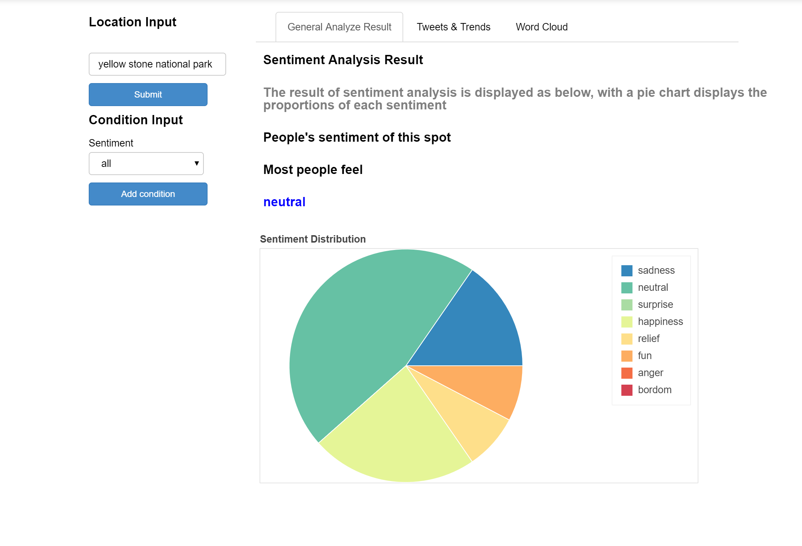
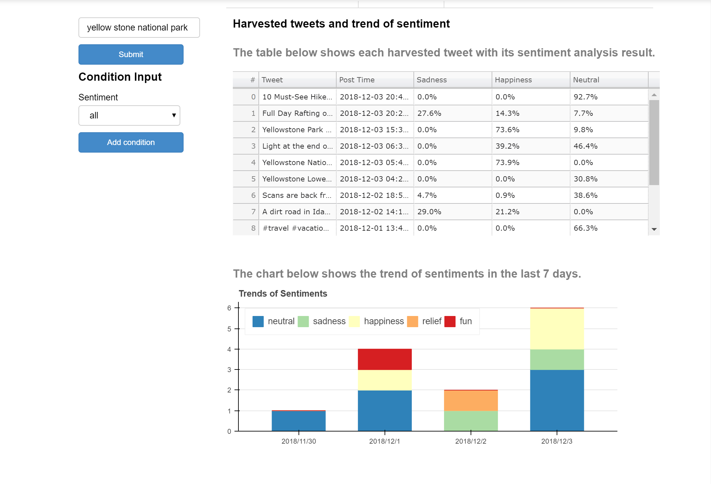
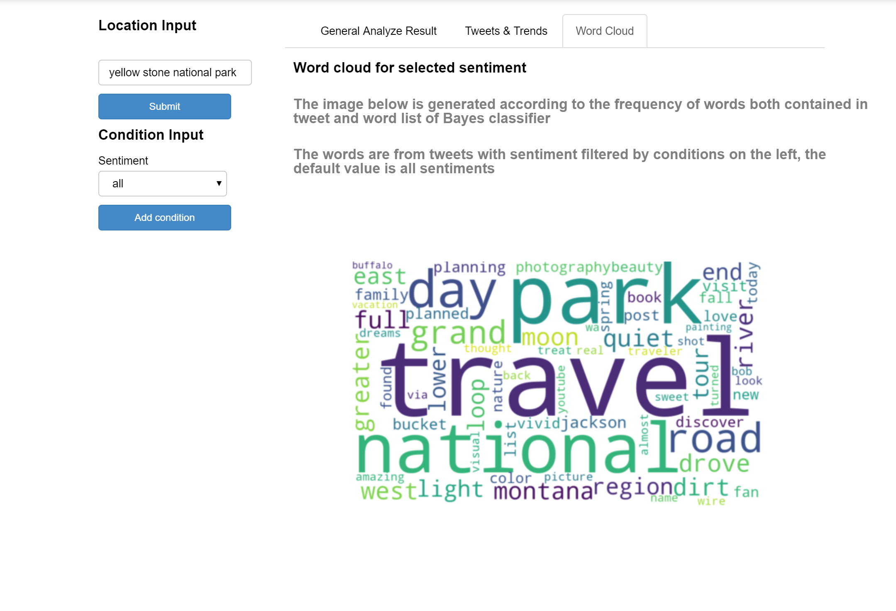

## TravelTwitter: Sentiment Analysis on Travel-related Tweets ##

This application is the term project of *CIS600 - Principles of Social Media Data Mining* in *Syracuse University*


Author: [Tianyu Qi](https://www.linkedin.com/in/tianyu-qi-477a25147/) , Bohao Li, Chang Liu

### Overview ###

The TravelTwitter application harvests data using Twitter search API, and provides sentiment analysis through a naive Bayes classifier and result visualize through bokeh package.



### Requirements ###

 1. Python     3.5.x (or higher)
 2. Anaconda   4.5.11 (or higher)
 3. python-twitter (latest)
 4. wordcloud (latest)
 5. Naive Bayes Classifier training data set

 For 3 and 4, you can install those package under your Anaconda directory by using ```pip install <package-name>```. And relaunch the Jupyter Notebook again (I did not try if restart kernel inside Jupyter Notebook is feasible, but it may).

 For 5, I find an ideal multi-sentiment marked train data set on [Kaggle](https://www.kaggle.com/c/sa-emotions/data). There are 13 sentiments in the data set. I ignored those marked with "worry" and "empty", and combined some of them, this process can be found in function ```processTrainData```.

### Get Started ###

To start using this application, you need to have a Twitter developer account at first. Then you will need to create a Twitter application in order to acquire tokens and keys.

After you get your tokens and keys, fill them in ```OAuth.json``` in this project in corresponding records.

When launching Jupyter Notebook, make sure the port number equals to ```PORT``` parameter in ```Global Parameter``` cell.

 

### Features ###

The application basically provides sentiment analysis of tweets harvested by three panels in bokeh application. Examples are shown as below:

#### General Analysis ####


This panel displays sentiment analysis conclusion, which is derived from the most sentiment classified by Bayes classifier. And below the conclusion is a pie chart shows the exact proportion of each sentiment.

#### Tweets and Trends ####



This panel displays sentiment classification result of each tweet. The tweets are filtered by Condition input select list on the left part of the application. Therefore the datatable can display tweets in a specified sentiment, default to all sentiments.

The bar chart below the datatable is the tweets with different sentiment sorted in days. As the standard Twitter API can only obtain the tweets in the last 7 days, the x-axis here is from 7 days before to today.

#### Word Clouds ####



Generate a word cloud by using keyword in tweets whose sentiment equal to the condition input select list value. By default it will generate a figure of keywords in all tweets.

### Limitations & Future Improvments ###

 1. The accuracy of naive Bayes classifier is really low in this application. This is caused by the original train data set, which has uneven count of each sentiments, which violets the assumption of naive Bayes classifier.
 2. Bokeh server has a poor performance in handling a web application. It only support few components, and hard to manipulate in code.